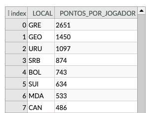
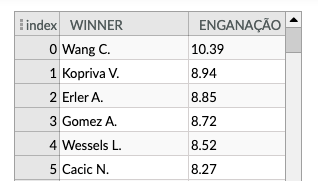

# Projeto TennisBets

# Equipe VGAHDM - VGA
* Artur Abreu Hendler - 231713
* Guilherme Zeferino Rodrigues Dobins - 236129
* João Vitor Baptista Moreira - 237833

## Resumo do Projeto
 O projeto consiste em uma análise de dados referente a apostas esportivas em confrontos de tênis e como fatores intrínsecos a um jogador e a esperança que os apostadores depositam nele podem influenciar no resultado final. Os dados serão coletados a partir de tabelas disponíveis em sites de históricos esportivos. Alguns desses sites não possuem arquivos com os dados prontos. Dessa maneira, pretendemos realizar a obtenção dos dados com um web crawler, de modo que possamos construir nossas próprias tabelas com os dados que nos interessem. A princípio, construiremos 4 modelos relacionais, que contém dados dos jogadores, dos torneios, dos confrontos e dos históricos de jogos.

## Slides da Apresentação
> [Slides](slides/slidesPrevia.pdf)

## Modelo Conceitual

> Coloque aqui a imagem do modelo conceitual final em ER ou UML, como o exemplo a seguir:
> 

## Modelos Lógicos

> Coloque aqui os modelos lógicos dos bancos de dados relacionados aos modelos conceituais. Para o modelo relacional, sugere-se o formato a seguir. Para outros modelos lógicos, sugere-se aqueles apresentados em sala.

> Exemplo de modelo lógico relacional
~~~
PESSOA(_Código_, Nome, Telefone)
ARMÁRIO(_Código_, Tamanho, Ocupante)
  Ocupante chave estrangeira -> PESSOA(Código)
~~~

> Para o modelo de grafos de propriedades, utilize este
> [modelo de base](https://docs.google.com/presentation/d/10RN7bDKUka_Ro2_41WyEE76Wxm4AioiJOrsh6BRY3Kk/edit?usp=sharing) para construir o seu.
> Coloque a imagem do PNG do seu modelo lógico como ilustrado abaixo (a imagem estará na pasta `image`):
>
> 

> Para o modelo de grafos de conhecimento, utilize a abordagem
> (recurso, propriedade, valor) para apresentar seu grafo exemplo.
> Coloque a imagem do PNG do seu modelo lógico como ilustrado abaixo (a imagem estará na pasta `image).
>
> Você pode usar um grafo ilustrando as classes, como este:
> 
>
> Além de outro com exemplo de instâncias, como este:
> 

> Para modelos hierárquicos (XML e JSON), utilize um formato
> conforme o abaixo:

> 

## Dataset Publicado
> Elencar os arquivos/bases preliminares dos datasets serão publicados.

título do arquivo/base | link | breve descrição
----- | ----- | -----
`<título do arquivo/base>` | `<link para arquivo/base>` | `<breve descrição do arquivo/base>`

> Os arquivos finais do dataset publicado devem ser colocados na pasta `data`, em subpasta `processed`. Outros arquivos serão colocados em subpastas conforme seu papel (externo, interim, raw). A diferença entre externo e raw é que o raw é em formato não adaptado para uso. A pasta `raw` é opcional, pois pode ser substituída pelo link para a base original da seção anterior.
> Coloque arquivos que não estejam disponíveis online e sejam acessados pelo notebook. Relacionais (usualmente CSV), XML, JSON e CSV ou triplas para grafos.
> Este é o conjunto mínimo de informações que deve constar na disponibilização do Dataset, mas a equipe pode enriquecer esta seção.

## Bases de Dados
> Elencar as bases de dados fonte utilizadas no projeto.

título da base | link | breve descrição
----- | ----- | -----
`<título da base>` | `<link para a página da base>` | `<breve descrição da base>`

## Detalhamento do Projeto
> Apresente aqui detalhes do processo de construção do dataset e análise. Nesta seção ou na seção de Perguntas podem aparecer destaques de código como indicado a seguir. Note que foi usada uma técnica de highlight de código, que envolve colocar o nome da linguagem na abertura de um trecho com `~~~`, tal como `~~~python`.
> Os destaques de código devem ser trechos pequenos de poucas linhas, que estejam diretamente ligados a alguma explicação. Não utilize trechos extensos de código. Se algum código funcionar online (tal como um Jupyter Notebook), aqui pode haver links. No caso do Jupyter, preferencialmente para o Binder abrindo diretamente o notebook em questão.

~~~python
df = pd.read_excel("/content/drive/My Drive/Colab Notebooks/dataset.xlsx");
sns.set(color_codes=True);
sns.distplot(df.Hemoglobin);
plt.show();
~~~

> Se usar Orange para alguma análise, você pode apresentar uma captura do workflow, como o exemplo a seguir e descrevê-lo:


> Coloque um link para o arquivo do notebook, programas ou workflows que executam as operações que você apresentar.

> Aqui devem ser apresentadas as operações de construção do dataset:
* extração de dados de fontes não estruturadas como, por exemplo, páginas Web
* agregação de dados fragmentados obtidos a partir de API
* integração de dados de múltiplas fontes
* tratamento de dados
* transformação de dados para facilitar análise e pesquisa

> Se for notebook, ele estará dentro da pasta `notebook`. Se por alguma razão o código não for executável no Jupyter, coloque na pasta `src` (por exemplo, arquivos do Orange ou Cytoscape). Se as operações envolverem queries executadas atraves de uma interface de um SGBD não executável no Jupyter, como o Cypher, apresente na forma de markdown.

## Evolução do Projeto


> Primeiramente, começamos a extrair os dados necessários para o dataset por meio de diferentes fontes. Algumas delas já disponibilizavam as informações por meios de arquivos csv, o que facilitou o processo. Entretanto, para extrair o número de seguidores dos jogadores no instagram, foi necessário realizar diversos requests para a plataforma e construir um script para selecionar apenas as informações que queríamos da página de cada jogador. Como as APIs que facilitam esse processo são pagas, o modo que utilizamos se mostrou muito lento e ineficiente caso fosse aplicado a um grande volume de dados. 

> Uma outra grande dificuldade que encontramos foi que, apesar das fontes apresentarem dados bastante completos e úteis para a análise, a falta de uma padronização entre as diversas fontes foi algo que gerou um grande conflito ao relacionar as tabelas. Alguns jogadores possuíam diferentes nomes em cada fonte. Por exemplo, o jogador Rafael Nadal possuía seu nome escrito como 'R. Nadal' em uma das fontes e 'Rafael Nadal' em outra. Dessa maneira, foi preciso construir um script que padronizasse o formato do nome de cada jogador. Entretanto, isso gerou outro problema, que foi o caso em que mais de um jogador possuía o mesmo nome abreviado que outro. Dessa maneira, as nossas análises entendiam que dois ou mais jogadores diferentes se tratavam do mesmo jogador.

> Para resolver esse problema, testamos algumas possibilidades que poderiam ser adicionadas como chave primária do jogador além de seu nome. A chave que se mostrou mais eficiente foi com nome e data de nascimento. Por outro lado, isso gerou outro conflito, que alguns dados da data de nascimento de alguns jogadores estavam faltando. Para corrigir isso, completamos dados faltantes com datas arbitrárias, em casos em que não era interessante excluir o jogador. Mas, na maior parte das vezes, notamos que os jogadores que possuíam dados faltantes eram em geral jogadores de menores expressão e que possuíam poucas partidas catalogadas. Por esse motivo, optamos por excluir tais jogadores do nosso dataset.

> Uma outra mudança que decidimos fazer ao longo do projeto foi com relação ao ranking. Inicialmente, tínhamos coletado os dados que eram atualizados a cada campeonato, ou seja, várias vezes ao mês. No final optamos por manter apenas o ranking final de cada ano, pois isso nos daria uma visão melhor da temporada dos jogadores, visto que muitos deles possuem calendários distintos conforme os países em que jogam. Ainda sobre o ranking, realizamos uma mudança na ideia inicial, que era analisar tanto o masculino quanto o feminino. Como se tratam de categorias diferentes e disputam campeonatos distintos, concluímos que faria mais sentido realizar análises separadamente.

> Em geral, conseguimos lidar bem com todas as dificuldades que encontramos, de modo que o dataset nos forneceu informações interessantes sobre o esporte. Além disso, o dataset pode ser constantemente atualizado para o futuro, visto que a cada ano são realizados novos campeonatos e as apostas online têm crescido bastante nos últimos anos, o que gera cada vez mais dados relevantes para o nosso estudo.

## Perguntas de Pesquisa/Análise Combinadas e Respectivas Análises

> Apresente os resultados da forma mais rica possível, com gráficos e tabelas. Mesmo que o seu código rode online em um notebook, copie para esta parte a figura estática. A referência a código e links para execução online pode ser feita aqui ou na seção de detalhamento do projeto (o que for mais pertinente).

> Liste aqui as perguntas de pesquisa/análise e respectivas análises. Nem todas as perguntas precisam de queries que as implementam. É possível haver perguntas em que a solução é apenas descrita para demonstrar o potencial da base. Abaixo são ilustradas três perguntas, mas pode ser um número maior a critério da equipe.
>
### Perguntas/Análise com Resposta Implementada

> As respostas às perguntas podem devem ser ilustradas da forma mais rica possível com tabelas resultantes, grafos ou gráficos que apresentam os resultados. Os resultados podem ser analisados e comentados. Veja um exemplo de figura ilustrando uma comunidade detectada no Cytoscape:

> 

#### Pergunta/Análise 1
> * QUAIS JOGADORES TIVERAM AS MELHORES PERFORMANCES INDIVIDUAIS EM UMA TEMPORADA NOS ÚLTIMOS 10 ANOS?
>   
>   * A cada ano novos jogadores tentam atingir a elite e se tornar o número 1 do ranking. Entretanto, alguns jogadores conseguem ser os melhores em várias temporadas, como podemos ver a seguir.

```
SELECT *
FROM Historico
WHERE ano_2010 =  (SELECT MAX(ano_2010) FROM Historico) OR
ano_2011 =  (SELECT MAX(ano_2011) FROM Historico) OR
ano_2012 =  (SELECT MAX(ano_2012) FROM Historico) OR
ano_2013 =  (SELECT MAX(ano_2013) FROM Historico) OR
ano_2014 =  (SELECT MAX(ano_2014) FROM Historico) OR
ano_2015 =  (SELECT MAX(ano_2015) FROM Historico) OR
ano_2016 =  (SELECT MAX(ano_2016) FROM Historico) OR
ano_2017 =  (SELECT MAX(ano_2017) FROM Historico) OR
ano_2018 =  (SELECT MAX(ano_2018) FROM Historico) OR
ano_2019 =  (SELECT MAX(ano_2019) FROM Historico) OR
ano_2020 =  (SELECT MAX(ano_2020) FROM Historico) 
```


#### Pergunta/Análise 2
> * QUAIS PAÍSES POSSUEM MAIS PONTOS POR JOGADOR NO RANKING EM 2019?
>   
>   * O incentivo ao esporte em diferentes países pode levar com que vários jogadores consigam ter sucesso na profissão de tenista. Dessa maneira, podemos analisar quais países possuem a maior média de pontos em seus jogadores profissionais, como visto na query abaixo.

```DROP VIEW IF EXISTS Ranking_per_country;
CREATE VIEW Ranking_per_country AS
SELECT nome, ano_2019, local
FROM Jogador, Historico
WHERE nome = name

DROP VIEW IF EXISTS Ranking_per_capita;
CREATE VIEW Ranking_per_capita as
SELECT LOCAL, SUM(ANO_2019) total, Count(local) num
FROM Ranking_per_country
GROUP BY LOCAL
ORDER BY total desc

SELECT local, total/num as pontos_por_jogador
from Ranking_per_capita
ORDER BY pontos_por_jogador desc
```

#### Pergunta/Análise 3
> * Quais foram os maiores enganadores nas partidas?
>   
>   * Analisando o dataset, vemos que muitos jogos em que as apostas a favor de um jogador são grandes e ele perde sua partida, assim como grandes apostas contra um jogador e ele consegue se superar e vencer o jogo. Pensando nisso, podemos analisar quais os jogadores mais subestimados e quais os mais superestimados.

```
DROP VIEW IF EXISTS WSUBESTIMADO;
CREATE VIEW WSUBESTIMADO AS
SELECT winner, AVG(oddwinner) odd_media, Count(winner) vitorias
FROM CONFRONTO
GROUP BY WINNER
ORDER BY odd_media desc

DROP VIEW IF EXISTS LSUBESTIMADO;
CREATE VIEW LSUBESTIMADO AS
SELECT loser, AVG(oddloser) odd_media, Count(loser) derrotas
FROM CONFRONTO
GROUP BY LOSER
ORDER BY odd_media desc

SELECT winner, (wsubestimado.odd_media * (VITORIAS/DERROTAS)) as enganação
FROM LSUBESTIMADO, WSUBESTIMADO
WHERE WINNER = LOSER
ORDER BY ENGANAÇÃO DESC

```

### Perguntas/Análise Propostas mas Não Implementadas

#### Pergunta/Análise 1
> * Pergunta 1
>   
>   * Explicação em linhas gerais de como a base pode ser usada para responder esta pergunta e a sua relevância.

#### Pergunta/Análise 2
> * Pergunta 2
>   
>   * Explicação em linhas gerais de como a base pode ser usada para responder esta pergunta e a sua relevância.

#### Pergunta/Análise 3
> * Pergunta 3
>   
>   * Explicação em linhas gerais de como a base pode ser usada para responder esta pergunta e a sua relevância.

> Coloque um link para o arquivo do notebook que executa o conjunto de queries. Ele estará dentro da pasta `notebook`. Se por alguma razão o código não for executável no Jupyter, coloque na pasta `src`. Se as queries forem executadas atraves de uma interface de um SGBD não executável no Jupyter, como o Cypher, apresente na forma de markdown.